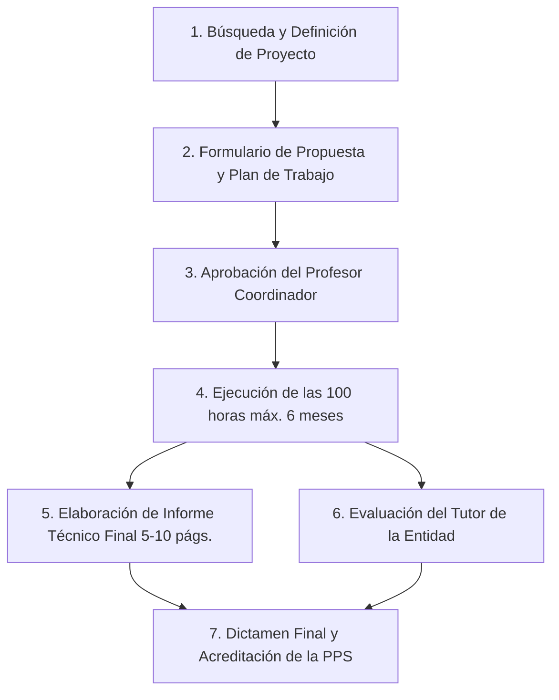

# 📚 Compendio Integral de Cátedras — Segundo Cuatrimestre 2026
### *Ciencia de Datos en Organizaciones (UNLP)*

> [!abstract] Resumen del Documento
> Este documento recopila y consolida **toda la información esencial** de las cátedras del cuatrimestre: equipos docentes, contactos, horarios de clase, modalidades de cursada, fechas de exámenes y entregas, criterios de promoción, programas analíticos detallados, proyectos integradores y bibliografía oficial.

---

## 🧭 Índice Rápido de Navegación
1. [[#📅 Calendario Maestro Consolidado Exámenes y Entregas]]
2. [[#🏫 Cuadro General de Horarios Semanales]]
3. [[#🗄️ 1. Bases de Datos]]
4. [[#🤖 2. Minería de Datos y Aprendizaje Automático (DM y ML)]]
5. [[#🏢 3. Tecnologías para la Gestión]]
6. [[#📊 4. Visualización de Grandes Volúmenes de Datos]]
7. [[#💼 5. Práctica Profesional Supervisada (PPS)]]

---

## 📅 Calendario Maestro Consolidado (Exámenes y Entregas)

| Fecha | Día | Asignatura | Tipo de Instancia | Detalle / Alcance |
| :---: | :---: | :--- | :--- | :--- |
| **01-oct** | Jueves | **Bases de Datos** | 📌 Hito TP | Definición del Trabajo Experimental NoSQL |
| **20-oct** | Martes | **Tecnologías para la Gestión** | 📝 **1º Parcial Teórico** | Bloque 1 y conceptos vistos hasta la fecha |
| **22-oct** | Jueves | **Bases de Datos** | 📦 **Entrega TP** | Entrega del Trabajo Experimental NoSQL |
| **04-nov** | Miércoles | **Minería y ML** | 📝 **1ra Fecha Examen** | Examen escrito individual |
| **04-nov** | Miércoles | **Visualización** | 📝 **1ra Fecha Examen** | Examen escrito individual |
| **05-nov** | Jueves | **Bases de Datos** | 🎤 **Defensa y Coloquio** | Defensa presencial del Trabajo Experimental |
| **18-nov** | Miércoles | **Minería y ML** | 📝 **2da Fecha Examen** | Examen escrito (Recuperatorio) |
| **18-nov** | Miércoles | **Visualización** | 📝 **2da Fecha Examen** | Examen escrito (Recuperatorio) |
| **01-dic** | Martes | **Tecnologías para la Gestión** | 📝 **2º Parcial Teórico** | Bloques 2 y 3 |
| **02-dic** | Miércoles | **Minería y ML** | 📝 **3ra Fecha Examen** | Examen escrito (Recuperatorio) |
| **02-dic** | Miércoles | **Visualización** | 📝 **3ra Fecha Examen** | Examen escrito (Recuperatorio) |
| **03-dic** | Jueves | **Tecnologías para la Gestión** | 🎤 **Presentación Final TPI** | Exposición Oral TPI (Grupo 1) |
| **10-dic** | Jueves | **Tecnologías para la Gestión** | 🎤 **Presentación Final TPI** | Exposición Oral TPI (Grupo 2) |
| **16-dic** | Martes | **Tecnologías para la Gestión** | 📝 **Recuperatorio General** | Recuperatorio Teórico Integrador |
| **17-dic** | Jueves | **Tecnologías para la Gestión** | 🏁 Cierre | Mesa Final y Cierre de Notas |

---

## 🏫 Cuadro General de Horarios Semanales

| Franja Horaria | Lunes | Martes | Miércoles | Jueves | Viernes |
| :---: | :---: | :---: | :---: | :---: | :---: |
| **10:00 - 13:00** | — | — | 🗄️ **Bases de Datos** *(Teoría)* 📍 *Aula Android, Ed. CIyTT* | — | — |
| **13:00 - 16:00** | — | — | — | — | 🤖 **Minería y ML** *(Teoría)* 📍 *Aula 14* |
| **14:00 - 16:00** | — | — | 📊 **Visualización** *(Teoría)* 📍 *Aula 9* | — | — |
| **15:00 - 16:30** | — | 📊 **Visualización** *(Práctica)* 📍 *Aula 9* | — | — | — |
| **18:00 - 19:00** | — | — | — | 🗄️ **Bases de Datos** *(Práctica 18 hs)* 📍 *Aula 9* | — |
| **19:00 - 22:00** | — | 🏢 **Tecnologías para la Gestión** *(Teoría)* | — | 🏢 **Tecnologías para la Gestión** *(Práctica)* | — |

---

## 🗄️ 1. Bases de Datos
- **Nota Principal**: [[10 Asignaturas/Bases de Datos/Bases de Datos|Panel de Bases de Datos]]
- **Carga Horaria**: 6 hs semanales | **Régimen**: Semestral | **Carácter**: Obligatoria
- **Correlativa Previa**: Introducción a Base de Datos

### 👨‍🏫 Equipo Docente y Canales
- **Profesor Titular**: Esp. Luciano Marrero
- **Email**: `lmarrero@lidi.info.unlp.edu.ar`
- **Plataforma Virtual**: IDEAS

### 🎯 Régimen de Evaluación y Aprobación
- **Modalidad**: Coloquio presencial integrador + defensa de un Trabajo Práctico Experimental (individual o grupal) sobre bases de datos NoSQL.
- **Hitos Obligatorios**:
  - **01/10**: Definición del trabajo experimental NoSQL.
  - **22/10**: Entrega del informe y código experimental.
  - **05/11**: Defensa presencial y coloquio.

### 📋 Contenidos y Ejes Temáticos
1. **Optimización de BD Relacionales y Normalización**:
   - Dependencias funcionales, redundancia y anomalías de actualización.
   - Formas normales (1FN, 2FN, 3FN, BCNF). Descomposición sin pérdida de información y preservación de dependencias.
2. **Almacenamiento No Estructurado y Bases de Datos NoSQL**:
   - Limitaciones del modelo relacional ante escalabilidad y Big Data. Teorema CAP.
   - Familias NoSQL: Clave-Valor (Redis, DynamoDB), Documentales (MongoDB), Orientadas a Grafos (Neo4j), Familia de Columnas (Cassandra).
   - Lenguajes de consulta NoSQL: MQL, Cypher, CQL.
3. **Bases de Datos Orientadas a Objetos (BDOO)**:
   - Conceptos fundamentales, persistencia y mapeo objeto-relacional (ORM).

---

## 🤖 2. Minería de Datos y Aprendizaje Automático (DM y ML)
- **Nota Principal**: [[10 Asignaturas/DM y ML/Minería y ML|Panel de Minería y ML]]
- **Carga Horaria**: 96 hs totales (6 hs semanales) | **Régimen**: Semestral | **Carácter**: Obligatoria
- **Correlativas Previas**: Matemática C, Probabilidades y Estadística, Fundamentos de IA

### 👨‍🏫 Equipo Docente y Canales
- **Profesores**: Dr. Franco Ronchetti y Dr. Waldo Hasperué
- **Emails**: `fronchetti@lidi.info.unlp.edu.ar` | `whasperue@lidi.info.unlp.edu.ar`
- **Plataforma Virtual**: Moodle UNLP

### 🎯 Régimen de Evaluación y Promoción
- **Requisitos de Aprobación**:
  1. **Trabajo Práctico Integrador Grupal** (nota $\ge 6$): Proyecto de extremo a extremo con dataset real (limpieza, ingeniería de atributos, entrenamiento de modelos, optimización e interpretación de métricas).
  2. **Examen Individual Escrito** (nota $\ge 6$): Evaluación teórica/práctica con **3 oportunidades** (1 examen + 2 recuperatorios).
- **Régimen de Promoción**: Promedio de ambas evaluaciones $\ge 6$.

### 📋 Hoja de Ruta y Cronograma por Semanas
- **Sem 1 (26/08)**: Introducción a la IA, Metodologías CRISP-DM y KDD, Aprendizaje Supervisado vs No Supervisado.
- **Sem 2 (02/09)**: Evaluación de modelos y preparación de datos (imputación, outliers, normalización, codificación).
- **Sem 3 (09/09)**: Árboles de decisión (ID3, C4.5, CART, entropía, ganancia de información, Gini, sobreajuste y poda).
- **Sem 4 (16/09)**: Ensambles de modelos (Bagging, Random Forest, Boosting, XGBoost/LightGBM).
- **Sem 5 (23/09)**: Extracción de características, balanceo de clases (SMOTE, undersampling) y Sistemas de Recomendación.
- **Sem 6 (30/09)**: Aprendizaje No Supervisado (K-Means, DBSCAN, Silhouette) y Reducción de Dimensionalidad (PCA, t-SNE).
- **Sem 7 (07/10)**: Redes Neuronales Artificiales, Regresión Lineal/Logística, Perceptrón Multicapa y Backpropagation.
- **Sem 8 (14/10)**: Métricas avanzadas de clasificación y regresión (ROC/AUC, F1, Precision-Recall, MAE, RMSE).
- **Sem 9 (21/10)**: Deep Learning: Convolucionales (CNN) para visión y Recurrentes (RNN/LSTM) para secuencias.
- **Sem 10 (28/10)**: Autoencoders, Arquitecturas Transformers, NLP y Modelos Generativos.
- **Sem 11 (04/11)**: 📝 **1ra Fecha de Examen Escrito**
- **Sem 13 (18/11)**: 📝 **2da Fecha de Examen Escrito (Recuperatorio)**
- **Sem 15 (02/12)**: 📝 **3ra Fecha de Examen Escrito (Recuperatorio)**

---

## 🏢 3. Tecnologías para la Gestión
- **Notas Principales**: 
  - [[10 Asignaturas/Tecnologías para la Gestión/Tecnologías para la Gestión|Panel Principal]]
  - [[10 Asignaturas/Tecnologías para la Gestión/Programa y Bibliografía|Programa y Bibliografía]]
  - [[10 Asignaturas/Tecnologías para la Gestión/TPI - Trabajo Práctico Integrador|Guía del TPI de Consultoría]]
- **Carga Horaria**: 96 hs totales (6 hs semanales) | **Régimen**: Semestral | **Carácter**: Obligatoria
- **Correlativas Previas**: Matemática C, Procesos de Negocio, Inglés

### 👨‍🏫 Equipo Docente y Canales
- **Profesor Teoría**: Diego Erben
- **Profesor Práctica**: Francisco Rubio
  - **Email**: `rubiofa@gmail.com` | **WhatsApp**: `+54 9 11 3195 8424`
  - **Consultas**: Jueves de 18:30 a 19:00 hs.
- **Plataforma Virtual**: Aula Virtual UNLP

### 🎯 Régimen de Evaluación y Promoción
- **Instancias Evaluativas**:
  - **1º Parcial Teórico**: 20 de Octubre de 2026.
  - **2º Parcial Teórico**: 01 de Diciembre de 2026.
  - **Recuperatorio General**: 16 de Diciembre de 2026.
  - **Trabajo Práctico Integrador (TPI)**: Grupal, rol de consultora sobre empresa real. 9 entregas acumulativas en Drive + Exposición final (03/12 y 10/12).
- **Condiciones de Calificación**:
  - **Promoción Directa**: Promedio general $\ge 7$.
  - **Aprobación de Cursada / Final**: Nota entre $4$ y $6$.
  - **Desaprobado**: Nota $< 4$.

### 📋 Síntesis de las 10 Unidades Temáticas
1. **TIC en la Gestión Organizacional**: Estrategia, ventaja competitiva, enfoque *Procesos - Personas - Tecnologías*.
2. **Sistemas de Información y Rol Gerencial**: MIS, DSS, EIS, calidad de datos y arquitectura digital óptima.
3. **Sistemas ERP**: Módulos funcionales, parametrización, operaciones, integración y panorama de mercado.
4. **Gestión de Clientes (CRM), Ecommerce y SCM**: Ciclo de vida del cliente, omnicanalidad, logística y trazabilidad.
5. **Business Intelligence (BI) y Datos**: Data Warehouse, cubos OLAP, ETL, KPIs y diseño de Dashboards gerenciales.
6. **Automatización (RPA) e Inteligencia Artificial**: Bots de software, machine learning en operaciones y rediseño de roles.
7. **Tecnologías Emergentes**: Big Data, Internet de las Cosas (IoT / *Smart Everything*), Cloud Computing y Blockchain.
8. **Estrategia y Gestión del Cambio**: Madurez digital (5 niveles, 6 dimensiones), cultura *data-driven*, resistencia al cambio.
9. **Selección e Implementación de Software**: SaaS vs On-Premise, desarrollo a medida vs estándar, matrices de selección y RFPs.
10. **Evaluación de Proyectos y ROI**: Business Case, análisis costo-beneficio, cálculo de ROI, TCO y Roadmap de implementación.

---

## 📊 4. Visualización de Grandes Volúmenes de Datos
- **Nota Principal**: [[10 Asignaturas/Visualización Big Data/Visualización|Panel de Visualización]]
- **Carga Horaria**: 96 hs totales (6 hs semanales) | **Régimen**: Semestral | **Carácter**: Obligatoria
- **Correlativas Previas**: Probabilidades y Estadística, Introducción a Base de Datos

### 👨‍🏫 Equipo Docente y Canales
- **Profesor Responsable**: Esp. César Estrebou
- **Email**: `cesarest@lidi.info.unlp.edu.ar`
- **Plataforma Virtual**: [Moodle de Asignaturas UNLP](https://asignaturas.info.unlp.edu.ar/)
- **Horarios**: Teoría: Miércoles 14-16 hs | Práctica: Martes 15-16:30 hs (Asistencia no obligatoria).

### 🎯 Régimen de Evaluación y Promoción
- **Instancias**:
  1. **Trabajo Práctico Integrador Grupal**: Grupos de **3 personas estrictamente**. Exploración de dataset masivo, diseño y programación de visualizaciones interactivas / dashboards y justificación perceptiva.
  2. **Examen Conceptual Individual**: Evaluación escrita con **3 oportunidades** (1 examen + 2 recuperatorios).
     - Fechas: **04-nov** (1ra fecha), **18-nov** (2da fecha), **02-dic** (3ra fecha).
- **Criterios**:
  - **Promoción Directa**: TP Grupal $\ge 6$ y Examen Individual $\ge 6$ (Nota final: promedio).
  - **Aprobación de Cursada**: TP Grupal $\ge 5$ y Examen Individual $\ge 5$ (Habilita final tradicional).

### 📋 Ejes Temáticos del Programa
1. **Introducción y Fundamentos**: Visualización para exploración, análisis y comunicación. Visualización científica vs infovis.
2. **Percepción y Cognición Visual**: Procesamiento preatencional, leyes de la Gestalt, variables visuales (Bertin), uso semántico del color.
3. **El Proceso y Pipeline de Visualización**: Modelo anidado de Munzner (Dominio, Abstracción, Modismo, Algoritmo), pipeline de Card.
4. **Tipologías de Datos y Codificación Visual**: Datos tabulares, redes/grafos, datos temporales, espaciales y jerárquicos (Treemaps).
5. **Interacción y Vistas Múltiples**: Técnicas *Overview first, zoom and filter, details on demand* (Shneiderman), vistas coordinadas y facetting.
6. **Big Data Visualization y Dashboards**: Técnicas de reducción perceptiva, sampling, binned scatterplots, diseño de tableros ejecutivos.
7. **Ética, Integridad y Storytelling**: Deformaciones estadísticas, cómo evitar engaños (*How Charts Lie*), narrativa de datos.

---

## 💼 5. Práctica Profesional Supervisada (PPS)
- **Nota Principal**: [[10 Asignaturas/PPS/PPS|Panel de PPS]]
- **Reglamento Oficial**: [[00 Organizador/propuestas-catedras/Reglamento-PPS-CDO.md|Reglamento PPS (CDO)]]
- **Carácter**: Requisito curricular obligatorio del Plan de Estudios 2024.

### 📌 Requisitos y Modalidad
- **Carga Horaria Mínima**: **100 horas acreditadas**.
- **Plazo Máximo de Ejecución**: **6 meses continuos** a partir de la aprobación de la propuesta.
- **Ámbitos Válidos**: Empresas privadas, organismos públicos, ONGs o proyectos de I+D y transferencia en la UNLP con aplicación en Ciencia de Datos.
- **Actores Intervinientes**:
  - **Estudiante**: Ejecutor del plan de trabajo.
  - **Profesor Coordinador (PC)**: Docente de la UNLP responsable del seguimiento académico y validación.
  - **Tutor de la Entidad (TE)**: Profesional designado por la empresa/entidad receptora.

### 📝 Circuito Administrativo y Entregables

1. **Formulario de Propuesta**: Define objetivos, justificación, cronograma de actividades y datos de la empresa/tutor.
2. **Informe Técnico Final**: Documento individual de 5 a 10 páginas que resume el contexto, problemas abordados, metodologías de datos empleadas, resultados obtenidos y conclusiones personales.
3. **Informe del Tutor de la Entidad**: Formulario de evaluación cualitativa y cuantitativa del desempeño técnico y profesional del estudiante.

---
[[Estudios Index|⬅ Volver al Índice General de Estudios]] | [[00 Organizador/Dashboard|📅 Ir al Dashboard Organizador]]
