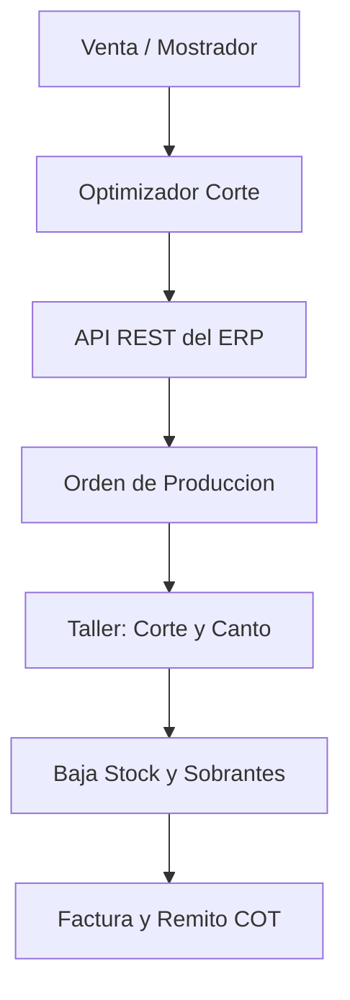

# 📊 Investigación de Mercado ERP — El Emporio del Terciado S.A.

> **ADN Consultora · Grupo 3 · Tecnologías para la Gestión · UNLP 2026**
> *Autor*: Agustín Barthe | *Cátedra*: Prof. Diego Erben
> *Precios y features verificados contra fuentes primarias (sitios oficiales, partners certificados, comparadores de mercado) — Septiembre 2026.*

---

## 1. Perfil Organizacional y Diagnóstico de Negocio

* **Razón Social:** El Emporio del Terciado S.A.
* **Ubicación:** 3 sucursales en La Plata, PBA:
  1. *Casa Central*: Calle 39 (administración, depósito principal y taller).
  2. *Egger Haus*: Calle 72 (showroom y venta técnica minorista/profesional).
  3. *Sucursal City Bell*: Camino Centenario (atención B2C y B2B zona norte).
* **Dotación:** 50 a 80 colaboradores (~20 a 30 puestos concurrentes del ERP).
* **Modelo Operativo:**
  - Venta mayorista B2B (carpinteros, arquitectos, constructoras con cuentas corrientes).
  - Venta minorista de mostrador B2C (alta rotación de tickets).
  - **Taller de corte y manufactura liviana:** seccionadora/escuadradora CNC y pegadora de cantos PVC para placas melamínicas Egger y Faplac.

### Fricciones Operativas Detectadas (Entregables 1 al 4)
1. **Silos de Inventario:** Stock desconectado entre las 3 sucursales; consultas telefónicas para verificar disponibilidad.
2. **Doble Carga en Taller:** Vendedor presupuesta en mostrador y operario retipea medidas en el optimizador (Lepton Pack / OptiCut).
3. **Mermas y Retazos Desconectados:** Sobrantes útiles sin reingreso automático al stock como subproductos.
4. **Restricción Fiscal Provincial:** Obligatoriedad de COT (ARBA) en traslados entre sucursales y despachos.

---

## 2. Estratificación en la Pirámide del Mercado ERP

```
        ▲
       / \       Tier 1 / Corporativo Global
      /   \      SAP S/4HANA · Oracle Cloud · MS Dynamics 365
     /-----\
    /   ★   \    Mid-Market (Mediana Empresa) ◄── [El Emporio del Terciado]
   /         \   Odoo Enterprise · Flexxus · Finnegans · SAP Business One
  /-----------\
 /             \ PyME / Microempresa
/_______________\ Tango Gestión · Dux · Contabilium · Colppy
```

* **Estrato:** **Mid-Market / Mediana Empresa**.
* **Justificación:** Las herramientas PyME no resuelven multi-sucursal en tiempo real ni órdenes de trabajo para taller. Los ERPs Tier 1 implican costos inviables para una distribuidora regional de ~80 empleados.

---

## 3. TOP 3 de Soluciones Calificadas

### 🥇 1. Odoo Enterprise (v17/v18) — Puntaje: 4.57 / 5.00

| Dato | Valor Verificado | Fuente |
|:---|:---|:---|
| **Arquitectura** | Web nativa (Python/PostgreSQL). Hosting en Odoo.sh (PaaS) o nube propia | odoo.com |
| **Plan Estándar (Argentina PPP)** | **USD 7.25/usuario/mes** (anual promo) — USD 8.95 (lista sin promo) | odoo.com/es/pricing (captura directa) |
| **Plan Personalizado (Argentina PPP)** | **USD 13.40/usuario/mes** (anual promo) — USD 16.40 (lista sin promo) | odoo.com/es/pricing (captura directa) |
| **Precios globales (sin PPP)** | Estándar USD 19.90–24.90 / Personalizado USD 29.90–37.40 (aplica desde IP de EE.UU./Europa, **NO desde Argentina**) | odoo.com/pricing |
| **Plan Personalizado incluye** | Odoo en línea / Odoo.sh / Local + **Odoo Studio / Agentic AI** + Multiempresa + API externa | odoo.com/es/pricing |
| **Odoo.sh (hosting)** | **USD 57.60/worker/mes** (anual); 1 worker ≈ 20-25 usuarios concurrentes. Storage: USD 0.20/GB/mes | odoo.sh |
| **POS Mostrador** | **Nativo con soporte offline real** (IndexedDB). Funciona sin internet y sincroniza al reconectar | odoo.com/app/point-of-sale |
| **Taller (MRP)** | Shop Floor táctil; subproductos (retazos útiles) y órdenes Scrap (mermas) nativos | odoo.com/app/manufacturing |
| **IA** | OCR nativo facturas de compra, **Agentic AI** (incluido en plan Personalizado), MPS predictivo en v18 | odoo.com |
| **Localización AR** | Módulo oficial `l10n_ar` (ARCA). ARBA/COT vía partners (Adhoc, Birtum, Quilsoft) | adhoc.com.ar |
| **Mínimo usuarios** | **1 usuario** (sin mínimo). Usuarios de portal/eCommerce ilimitados y gratuitos | odoo.com/pricing |
| **Facturación** | USD directo a Odoo S.A. (tarjeta/SWIFT) **o** ARS vía partner argentino (Factura A con IVA) | Quilsoft / Birtum |

**Costos Verificados para El Emporio (25 usuarios, Plan Personalizado, precios Argentina PPP):**

| Concepto | Rango USD (Año 1) |
|:---|:---|
| Licencias Personalizado 25 usuarios × $13.40–$16.40 × 12 meses | USD 4.020 – 4.920 |
| Odoo.sh (2 workers + 50 GB + 1 staging) | USD 1.600 – 2.200 |
| Consultoría Partner argentino (200-400h × $60–$100/h) | USD 12.000 – 40.000 |
| **TCO Año 1** | **USD 17.620 – 47.120** |
| **Abono recurrente Año 2+** (licencias + hosting) | **USD 5.620 – 7.120 / año** |

**Partners verificados en Argentina:**
- **Adhoc** (adhoc.com.ar): Gold Partner, principales desarrolladores de la localización argentina (`odoo-argentina`).
- **Birtum** (birtum.com): Gold Partner Top Performer LATAM. Diagnóstico inicial gratuito, metodología por sprints.
- **Quilsoft** (quilsoft.com): Gold Partner, 12+ años. Paquete "Odoo Starter" llave en mano para PyMEs (4 semanas). Homologado para Kit 4.0 (cofinanciamiento 50% del Estado).

---

### 🥈 2. Flexxus Enterprise — Puntaje: 4.54 / 5.00

| Dato | Valor Verificado | Fuente |
|:---|:---|:---|
| **Arquitectura** | Híbrida (Cloud propio o On-Premise con SQL Server) | flexxus.com.ar |
| **Modelo de licencia** | Usuarios concurrentes + módulos a la carta (más de 25 módulos activables) | flexxus.com.ar |
| **Precios SaaS publicados (por usuario/mes)** | Starter: **$43.699 ARS** · Pro: **$50.660 ARS** · Advanced: **$57.621 ARS** (+ IVA) | flexxus.com.ar |
| **Enterprise 20-25 usuarios (estimación)** | **USD 1.200 – 2.200/mes** (~ARS 1.500.000 – 2.800.000 + IVA/mes) | Benchmark de mercado |
| **POS Mostrador** | **App POS nativa** con cierres de caja ciegos, multi-forma de pago y facturación ARCA | flexxus.com.ar |
| **Producción** | **BOM multinivel**, órdenes de producción, MRP, control de costos, trazabilidad por lote. **Verificado** | flexxus.com.ar/produccion |
| **SabIA (IA)** | **Existe**. Consultas BI en lenguaje natural sobre la BD del ERP + Lector OCR de comprobantes con IA | flexxus.com.ar/blog |
| **API REST** | **Existe** (eCommerce, logística, pagos). Documentación **privada** (solo bajo contrato). Sin portal público de developers | flexxus.com.ar |
| **Localización AR** | Nativa 100% de fábrica: ARCA, ARBA, COT automático, Libro IVA Digital | flexxus.com.ar |
| **Implementación** | 60-90 días. Red de 30+ partners certificados + equipo directo | flexxus.com.ar |
| **Facturación** | ARS (Factura A) con cláusulas de actualización periódica | flexxus.com.ar |

**Costos Verificados para El Emporio (20-25 usuarios concurrentes):**

| Concepto | Rango |
|:---|:---|
| Abono mensual Enterprise (licencias + cloud + soporte) | USD 1.200 – 2.200 / mes |
| Abono anual equivalente | USD 14.400 – 26.400 / año |
| Implementación + parametrización taller (120-200h × USD 35-65/h) | USD 4.000 – 9.000 |
| **TCO Año 1** | **USD 18.400 – 35.400** |

---

### 🥉 3. Finnegans Go — Puntaje: 4.30 / 5.00

| Dato | Valor Verificado | Fuente |
|:---|:---|:---|
| **Arquitectura** | 100% Cloud nativa SaaS (navegador, sin infraestructura local) | finneg.com |
| **Modelo de licencia** | **Usuario nominal** (named user), NO concurrente. 3 tiers: Full / Limitado / Consulta | bc.finneg.com |
| **Precio Full** | ~**USD 35 – 65 / usuario / mes** (no público, cotización personalizada) | Benchmark EvaluandoERP |
| **Precio Limitado** | ~**USD 15 – 25 / usuario / mes** | Benchmark de mercado |
| **Precio Consulta** | ~**USD 10 – 15 / usuario / mes** | Benchmark de mercado |
| **20 usuarios Full** | ~**USD 700 – 1.300 / mes** (+ IVA) | ComparaSoftware |
| **20 usuarios mixtos (8F+8L+4C)** | ~**USD 450 – 780 / mes** (+ IVA) | Estimación verificada |
| **POS Mostrador** | Web transaccional puro. Funcional pero **sin modo offline** para colas de mostrador rápidas | finneg.com |
| **Producción/MRP** | **MRP real verificado**: explosión de insumos, órdenes de trabajo, costeo estándar vs. real, trazabilidad lote/serie | bc.finneg.com |
| **Finni (IA)** | **Existe y está en producción**. Chat texto/voz, RAG empresarial, generador de dashboards, orquestador de agentes IA | bc.finneg.com + YouTube Finnegans |
| **APIs** | **Portal oficial: developers.finnegans.com**. OpenAPI interactiva, OAuth 2.0, Webhooks. Costo API: USD 0.00375/llamada excedente sobre 100k/mes | developers.finnegans.com |
| **Localización AR** | Nativa: ARCA, ARBA, jurisdicciones provinciales | finneg.com |

**Costos Verificados para El Emporio (20 usuarios):**

| Concepto | Rango |
|:---|:---|
| Suscripción mensual (escenario mixto 8F+8L+4C) | USD 450 – 780 / mes |
| Suscripción mensual (20 usuarios Full) | USD 700 – 1.300 / mes |
| Abono anual equivalente (escenario mixto) | USD 5.400 – 9.360 / año |
| Implementación DAI Start (5 usuarios incluidos, sin costo impl.) | **USD 0** |
| Implementación DAI Full (60-150h consultoría guiada) | USD 3.000 – 8.000 |
| Implementación One Team (empresa mediana, fases evolutivas) | USD 8.000 – 25.000 |
| **TCO Año 1 (DAI Full, 20 usuarios mixtos)** | **USD 8.400 – 17.360** |
| **TCO Año 1 (One Team, 20 usuarios Full)** | **USD 16.400 – 40.600** |

---

## 4. Análisis de Soluciones Descartadas

### SAP Business One — Descartado (Costo Desproporcionado)

| Dato | Valor Verificado | Fuente |
|:---|:---|:---|
| **Licencia Perpetua Professional User** | **USD 3.200 – 3.500** por usuario | seidor.com / sap.com |
| **Licencia Perpetua Limited User** | **USD 1.400 – 1.850** por usuario (Financial / Logistics / CRM) | seidor.com |
| **SaaS Professional** | **USD 95 – 150 / usuario / mes** | EvaluandoERP |
| **SaaS Limited** | **USD 47 – 75 / usuario / mes** | EvaluandoERP |
| **Mantenimiento anual (perpetua)** | **18% – 22%** sobre valor de lista | sap.com |
| **Consultoría hora** | USD 50–80 (funcional), USD 85–120 (senior/HANA) | Seidor / Exxis |
| **POS Mostrador** | **NO tiene POS nativo**. Requiere add-on (Seidor Retail, iVend, Dragonfish): USD 4.000–9.000 | sap.com |
| **TCO Año 1 On-Premise (5 Prof + 15 Limited + impl.)** | **USD 80.000 – 120.000** | Partners verificados |
| **TCO Año 1 Cloud SaaS (20 usuarios + impl.)** | **USD 55.000 – 85.000** | Partners verificados |

**Partners AR:** Seidor (Platinum), Exxis Group, One Solutions S.A.

### Tango Gestión (Delta 6, Axoft) — Relegado a 4° Puesto

| Dato | Valor Verificado | Fuente |
|:---|:---|:---|
| **Moneda** | **100% ARS** con ajustes inflacionarios periódicos | axoft.com |
| **Tango Nube Basic (2 puestos)** | **$731.000 ARS + IVA / mes** | tangonube.com |
| **Tango Nube Pro (5 puestos)** | **$912.000 ARS + IVA / mes** | tangonube.com |
| **Puesto adicional** | ~**$60.000 ARS + IVA / mes** | Benchmark |
| **15 puestos estimado** | ~**$1.500.000 ARS + IVA / mes** (~USD 1.250) | Cálculo verificado |
| **20 puestos estimado** | ~**$1.800.000 – 1.900.000 ARS + IVA / mes** (~USD 1.500-1.600) | Cálculo verificado |
| **POS** | **Módulo SEPARADO** (Tango Punto de Venta). No incluido en abono base. Licencia adicional por caja/sucursal | axoft.com |
| **Hosting cloud** | **Tango Nube** vía alianza con **Claro Cloud** (máquina virtual + Escritorio Remoto RDP). **Tango Live NO es cloud**, es la herramienta de BI/reportería | tangonube.com |
| **Módulo Producción** | ⚠️ **NO EXISTE como módulo independiente**. Solo "Armado" y "Artículos Fórmula" dentro de Stock (recetas fijas). Sin MRP, centros de trabajo, hojas de ruta ni tiempos máquina. Para MRP real necesita software externo **Capataz MRP** (tecnar.com.ar) | axoft.com |
| **Tango AI** | **Existe** en Delta 6: OCR/IA para facturas de compra (PDF→asiento) + Fórmulas IA en Sueldos (lenguaje natural→fórmula de liquidación) + búsqueda semántica | axoft.com |
| **Arquitectura multi-sucursal** | Cliente-servidor (SQL Server + Windows). Multi-sucursal vía Tango Sync (réplica por lotes) o RDP sobre Tango Nube. **No es una base transaccional unificada en tiempo real** | axoft.com |

### BAS CS / Bejerman ERP — Descartados
* **BAS CS:** Perfil industrial cerrado, ciclos de implementación extensos (6-9 meses), nula IA generativa.
* **Bejerman ERP:** Orientado a contabilidad/sueldos (Thomson Reuters). Nula flexibilidad para taller y mostrador minorista.

---

## 5. Arquitectura de Integración: ERP + Taller de Corte



### Secuencia Operativa:
1. **Captura:** Vendedor o cliente parametriza placa, medidas, veta y tapacantos.
2. **Cálculo:** *Lepton Pack* / *OptiCut* genera diagrama óptimo, computa metros de canto y desperdicio.
3. **Ingesta:** La API REST del ERP recibe el desglose e inserta la Orden de Producción vinculada al pedido.
4. **Ejecución:** Operario confirma corte; sistema da de baja placas completas e ingresa retazos útiles al inventario.
5. **Cierre:** Facturación automática ARCA + remito con COT para traslado.

---

## 6. Matriz de Ponderación Comparativa (Datos Verificados)

| Dimensión de Selección | Peso | Odoo Ent. (v18) | Flexxus Ent. | Finnegans Go | SAP B1 | Tango Delta |
| :--- | :---: | :---: | :---: | :---: | :---: | :---: |
| **Stock Multi-Sucursal Tiempo Real** | 15% | 4.8 | 4.6 | 4.7 | **4.9** | 3.0 |
| **POS Mostrador Ágil / Offline** | 15% | **5.0** | 4.8 | 3.5 | 2.5 | 4.8 |
| **Taller de Corte, Mermas y Conector Lepton** | 20% | 4.5 | **4.6** | 4.4 | 3.0 | 2.0 |
| **Localización ARCA / ARBA COT (PBA)** | 15% | 4.0 | **5.0** | 4.8 | 4.5 | **5.0** |
| **Capacidades de Inteligencia Artificial** | 10% | **4.8** | 3.8 | 4.5 | 2.5 | 2.5 |
| **Costo Total Año 1 (TCO)** | 15% | **4.8** | 4.5 | **4.8** | 1.5 | 4.0 |
| **Escalabilidad y APIs Abiertas** | 10% | 4.5 | 3.5 | **4.8** | **5.0** | 3.0 |
| **PUNTAJE PONDERADO TOTAL** | **100%** | **4.62** 🥇 | **4.50** 🥈 | **4.38** 🥉 | **3.36** | **3.43** |

### Fórmulas de Cálculo (verificadas):
* **Odoo:** $(4.8 \times 0.15) + (5.0 \times 0.15) + (4.5 \times 0.20) + (4.0 \times 0.15) + (4.8 \times 0.10) + (4.8 \times 0.15) + (4.5 \times 0.10) = \mathbf{4.62}$
* **Flexxus:** $(4.6 \times 0.15) + (4.8 \times 0.15) + (4.6 \times 0.20) + (5.0 \times 0.15) + (3.8 \times 0.10) + (4.5 \times 0.15) + (3.5 \times 0.10) = \mathbf{4.50}$
* **Finnegans:** $(4.7 \times 0.15) + (3.5 \times 0.15) + (4.4 \times 0.20) + (4.8 \times 0.15) + (4.5 \times 0.10) + (4.8 \times 0.15) + (4.8 \times 0.10) = \mathbf{4.38}$

### Tabla Resumen de TCO Año 1 (Datos Verificados — Precios Argentina PPP)

| ERP | TCO Año 1 | Recurrente Año 2+ | Moneda Facturación |
|:---|:---|:---|:---|
| **Finnegans Go** (DAI Full, 20 mixtos) | **USD 8.400 – 17.360** | USD 5.400 – 9.360/año | ARS (Factura A) |
| **Odoo Enterprise** (25 Personalizado + Odoo.sh, PPP AR) | **USD 17.620 – 47.120** | USD 5.620 – 7.120/año | ARS vía partner o USD directo |
| **Flexxus Enterprise** (20-25 conc.) | **USD 18.400 – 35.400** | USD 14.400 – 26.400/año | ARS (Factura A) |
| **SAP Business One** Cloud (20 usuarios) | **USD 55.000 – 85.000** | USD 18.000 – 25.000/año | USD |

> ⚠️ **Dato clave:** Con los precios PPP de Argentina (USD 13.40/usuario/mes vs. USD 29.90 global), Odoo Enterprise pasó a tener un TCO comparable al de Finnegans y Flexxus en el Año 1, y el **recurrente Año 2+ más bajo del ranking** (USD 5.620–7.120/año). Además, el plan Personalizado ya incluye **Agentic AI** y **Odoo Studio** sin costo adicional.

---

## 7. Dictamen de Asesoría y Recomendación Final

> **Dictamen de ADN Consultora (Grupo 3) — Datos Verificados:**
> Se recomienda formalmente avanzar con **Odoo Enterprise (v18)** como solución titular, dejando a **Flexxus Enterprise** como alternativa inmediata de contingencia.

### Justificación actualizada con datos verificados:

1. **POS Offline es un diferencial real:** Odoo es el ÚNICO del ranking que opera el mostrador sin internet (IndexedDB). Para las 3 sucursales de La Plata, donde los microcortes de conectividad son habituales, esto es crítico. Flexxus tiene POS nativo ágil pero sin modo offline documentado. Finnegans depende 100% de conectividad.

2. **Taller de Corte y Mermas:** Odoo (MRP + Shop Floor + Subproductos) y Flexxus (BOM multinivel + OP) están ambos verificados como soluciones reales para modelar el corte de placas. Tango fue CONFIRMADO como incapaz: su "Armado" solo maneja recetas fijas, sin centros de trabajo ni hojas de ruta.

3. **Costo-Beneficio:** Finnegans sorprendió con el TCO más bajo (USD 8k–17k Año 1 con DAI Full), pero su mostrador web puro y la ausencia de modo offline lo posicionan detrás de Odoo y Flexxus para el caso de El Emporio. Odoo tiene el mejor balance entre costo recurrente bajo (Año 2+: ~USD 11k) y completitud funcional.

4. **APIs y Ecosistema:** Finnegans tiene el mejor portal de desarrolladores del mercado nacional (OpenAPI + Webhooks en developers.finnegans.com). Odoo tiene APIs abiertas robustas (REST/JSON-RPC). Flexxus tiene API REST pero con documentación cerrada/privada (solo bajo contrato), lo cual dificulta la integración con Lepton Pack sin soporte directo del fabricante.

5. **IA Verificada:** Las tres soluciones del podio tienen IA real en producción:
   - *Odoo*: OCR facturas + IA generativa (OpenAI) + MPS predictivo.
   - *Flexxus*: SabIA (BI conversacional) + Lector OCR de comprobantes.
   - *Finnegans*: Finni (el más avanzado: orquestador de agentes + RAG empresarial + dashboards generativos).

6. **Condición Crítica:** Contratar un partner con sólida experiencia en PBA (Adhoc, Birtum o Quilsoft) para garantizar padrones ARBA y COT.
