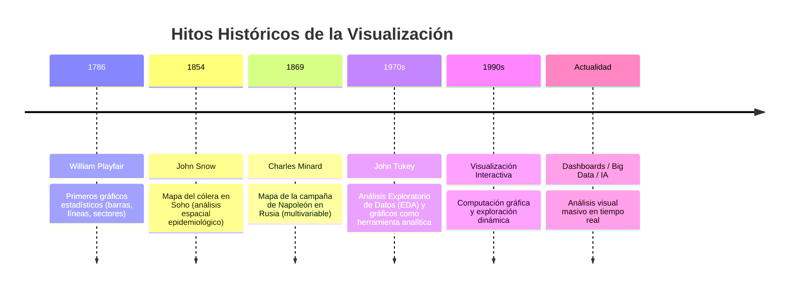

# 📊 Clase 1: Introducción a la Visualización de Datos

**Fecha**: 26 de Agosto de 2026  
**Materia**: [[10 Asignaturas/Visualización Big Data/Visualización|Visualización de Grandes Volúmenes de Datos]]  
**Profesor**: Esp. César Estrebou  
**Material de referencia**: [[01-Introducción a la Visualización de Datos.pdf|Filminas Clase 1 (PDF)]] | [[00_Info General.pdf|Información General de la Cátedra]]

---

## 📌 Objetivos de la Sesión
- [x] Comprender el concepto fundamental de visualización de datos y su impacto cognitivo.
- [x] Analizar por qué es necesario visualizar más allá de la estadística descriptiva (El cuarteto de Anscombe).
- [x] Identificar las metas de la visualización: comunicación, exploración, análisis y confirmación.
- [x] Diferenciar entre visualización científica y visualización de información, así como entre infografía y visualización de datos.
- [x] Conocer los hitos históricos fundamentales (Playfair, Snow, Minard, Tukey) y casos de estudio modernos.

---

## 🧭 ¿Qué es la Visualización de Datos?

> [!NOTE] Definición Fundamental
> La **visualización de datos** es la representación visual (estática o interactiva) de datos abstractos o espaciales diseñada para **reforzar y amplificar la cognición humana**.
> 
> $$\text{Datos} \longrightarrow \text{Representación Visual} \longrightarrow \text{Comprensión / Cognición}$$

* **No es solo mostrar gráficos**: Busca hacer visibles aspectos, patrones, relaciones y anomalías ocultas que serían extremadamente difíciles de percibir o interpretar directamente en tablas numéricas.
* **Interdisciplinariedad**: Integra ciencia de la computación, estadística, psicología de la percepción, diseño gráfico y análisis de dominio.

---

## 🔬 ¿Por qué Necesitamos Visualizar? El Cuarteto de Anscombe (1973)

Francis Anscombe demostró que conjuntos de datos con **idénticas propiedades estadísticas descriptivas** pueden tener estructuras y distribuciones completamente diferentes cuando se grafican.

### Propiedades estadísticas idénticas en los 4 conjuntos:
- **Número de observaciones ($n$)**: $11$
- **Media de $x$ ($\bar{x}$)**: $9.00$
- **Media de $y$ ($\bar{y}$)**: $7.50$
- **Varianza de $x$**: $11.00$
- **Varianza de $y$**: $3.75$
- **Correlación lineal ($r$)**: $0.816$
- **Recta de regresión lineal**: $y = 3.0 + 0.5x$

```
Dataset I:   Relación lineal simple con dispersión normal.
Dataset II:  Relación no lineal perfectamente cuadrática (curvilínea).
Dataset III: Relación lineal perfecta con un outlier influyente.
Dataset IV:  Valores de x idénticos (x=8) excepto un solo outlier extremo en x=19.
```

> [!IMPORTANT] Conclusión de Anscombe
> Las métricas estadísticas numéricas son resúmenes que pueden ocultar la verdadera naturaleza de los datos. La inspección visual es indispensable para el razonamiento analítico.

---

## 🎯 Metas y Propósitos de la Visualización

Una misma visualización puede responder a uno o varios propósitos:

1. **Comunicación**: Presentar información estructurada, explicar conclusiones y transmitir hallazgos a una audiencia determinada.
2. **Análisis y Exploración**: Apoyar el razonamiento analítico, la búsqueda de patrones no evidentes, detección de anomalías y generación de nuevas preguntas.
3. **Confirmación**: Permitir contrastar hipótesis previas y verificar resultados obtenidos mediante modelos o análisis cuantitativos.
4. **Registro / Almacenamiento**: Preservar información estructurada en un formato compacto que facilite futuras consultas y soporte cognitivo.

### 🔍 Exploración vs. Comunicación

| Dimensión | Visualización Exploratoria | Visualización Comunicativa |
| :--- | :--- | :--- |
| **Objetivo** | Descubrir qué hay en los datos | Explicar y transmitir lo ya descubierto |
| **Audiencia** | El propio analista o investigador | Clientes, tomadores de decisiones o público general |
| **Interacción** | Alta (filtros, zoom, múltiples vistas) | Enfocada (narrativa guiada, anotaciones, claridad) |
| **Pregunta guía** | *"¿Qué patrones o anomalías existen?"* | *"¿Qué conclusión principal debes observar?"* |
| **Enfoque** | Buscar patrones, formular hipótesis | Resumir, destacar hallazgos, contar una historia |

---

## 📊 Infografía vs. Visualización de Datos

| Característica | Infografía | Visualización de Datos |
| :--- | :--- | :--- |
| **Composición** | Combina gráficos, texto explicativo, ilustraciones y diseño editorial. | Se centra primordialmente en la codificación rigurosa de variables en elementos visuales. |
| **Narrativa** | Guiada, estática, con un mensaje predeterminado. | Abierta o interactiva, orientada a la exploración o análisis. |
| **Uso** | Divulgación, medios periodísticos, marketing. | Análisis de datos, investigación científica, dashboards operativos y estratégicos. |

> *Nota*: No son categorías mutuamente excluyentes; una visualización de datos rigurosa puede formar parte de una infografía.

---

## 🌐 Dos Grandes Contextos de Visualización

1. **Visualización Científica (*Scientific Visualization*)**:
   - Trabaja con fenómenos del mundo físico o espacial (datos continuos, coordenadas geográficas 3D, simulaciones físicas, tomografías, fluidodinámica, meteorología).
   - El espacio de representación suele corresponder directamente al espacio físico real.

2. **Visualización de Información (*Information Visualization*)**:
   - Trabaja con datos abstractos y estructurados (tablas relacionales, jerarquías, grafos/redes, texto, transacciones financieras, métricas de negocio).
   - Requiere diseñar un mapeo espacial artificial (por ejemplo, definir qué variable ocupa el eje $X$, el eje $Y$, o el color).

---

## 📜 Breve Evolución Histórica de la Visualización



### Hitos Destacados:
* **William Playfair (1786)**: Publicó *The Commercial and Political Atlas*, introduciendo por primera vez gráficos de líneas, barras y diagramas circulares para representar la economía británica.
* **Dr. John Snow (1854)**: Mapeó las muertes por cólera en el distrito de Soho (Londres), identificando que los casos se concentraban alrededor de la bomba de agua de Broad Street, refutando la teoría miasmática.
* **Charles Joseph Minard (1869)**: *Carta figurativa de las pérdidas sucesivas de hombres de la armada francesa en la campaña de Rusia 1812-1813*. Considerado uno de los mejores gráficos de la historia por combinar **6 variables** en un solo plano:
  1. Cantidad de soldados (grosor del trazo).
  2. Posición geográfica 2D (latitud y longitud).
  3. Dirección del ejército (avance en color claro, retirada en negro).
  4. Fechas clave.
  5. Temperatura registrada durante la retirada (gráfico inferior acoplado).
  6. Cruces de ríos y batallas principales.
* **John Tukey (década de 1970)**: Padre del *Exploratory Data Analysis* (EDA) y creador del *Boxplot* (diagrama de caja), promovió el uso de gráficos como paso esencial para generar hipótesis antes del modelado probabilístico.

---

## 💻 Casos de Estudio y Ejemplos Modernos

1. **Flujo de Viento en Tiempo Real ([hint.fm/wind](http://hint.fm/wind/))**: Representación vectorial animada que muestra patrones de circulación atmosférica sobre EEUU.
2. **Seguimiento de Rayos en Tiempo Real ([iweathernet.com](https://www.iweathernet.com/lightning/latest-lightning-strikes-on-google-maps))**: Mapeo geoespacial en tiempo real de descargas eléctricas sobre mapas satelitales.
3. **Plataforma Meteorológica Global ([windy.com](https://www.windy.com/))**: Animación de partículas escalable para visualización de vientos, temperaturas, olas y presión.
4. **Códice Atlántico interactivo ([codex-atlanticus.it](https://codex-atlanticus.it))**:
   - Colección de 1.119 láminas de Leonardo Da Vinci (1478–1519).
   - Visualización interactiva que permite filtrar por temas (botánica, vuelo, armamento, matemáticas), año de creación y números de hoja.
5. **Aaron Koblin (Artista de Medios y Visualización)**:
   - *Flight Patterns*: Trazas de luz que mapean el tráfico aéreo sobre EEUU, codificando altitud y tipo de aeronave con colores y densidad de rutas.
   - *Amsterdam SMS*: Representación 3D del flujo y densidad espaciotemporal de mensajes de texto en la noche de Año Nuevo.
6. **Visualización de Algoritmos ([sortvision.com](https://www.sortvision.com/es))**: Animación paso a paso de algoritmos de ordenamiento (ej. *Bubble Sort*), mapeando el valor a la altura de barras y la posición al estado del puntero.

---

## 💡 5 Ideas Clave para Recordar

1. **Visualizar es representar datos para facilitar su comprensión y toma de decisiones.**
2. **Toda visualización debe tener un propósito claro**: explorar, analizar, comunicar o confirmar.
3. **La percepción visual humana es el canal con mayor ancho de banda cognitivo**, pero tiene sesgos y limitaciones que deben considerarse en el diseño.
4. **Visualizar revela patrones, anomalías y relaciones** que las métricas estadísticas agregadas ocultan (como en el Cuarteto de Anscombe).
5. **La disciplina es intrínsecamente interdisciplinaria**: combina análisis de datos, ciencias de la computación, psicología cognitiva y diseño.

---

## 🔗 Recursos para Seguir Explorando
- [Infogram Examples](https://infogram.com/examples) — Ejemplos de infografías y gráficos interactivos.
- [FlowingData](https://flowingdata.com) — Blog de Nathan Yau sobre diseño y análisis visual.
- [ObservableHQ](https://observablehq.com/) — Plataforma de notebooks para visualización de datos con D3.js y JavaScript.

---

## 📚 Bibliografía y Lecturas Recomendadas para la Unidad 1

- **Ward, M., Grinstein, G., & Keim, D. (2015)**. *Interactive Data Visualization: Foundations, Techniques, and Applications*. CRC Press.
- **Tominski, C., & Schumann, H. (2020)**. *Interactive Visual Data Analysis*. CRC Press.
- **Munzner, T. (2014)**. *Visualization Analysis and Design*. CRC Press (Capítulo 1: *What's Vis, and Why Do It?*).
- **Tufte, E. R. (2001)**. *The Visual Display of Quantitative Information*. Graphics Press.
- **Steele, J., & Iliinsky, N. (2011)**. *Designing Data Visualizations*. O'Reilly Media.
- **Cairo, A. (2016)**. [[The Truthful Art - Alberto Cairo.pdf|The Truthful Art: Data, Charts, and Maps for Communication]]. New Riders.
- **Cairo, A. (2019)**. [[How Charts Lie - Alberto Cairo.pdf|How Charts Lie: Getting Smarter about Visual Information]]. W. W. Norton.
- **Healy, K. (2018)**. [[Data Visualization - A Practical Introduction - Kieran Healy.pdf|Data Visualization: A Practical Introduction]]. Princeton University Press.

---
[[10 Asignaturas/Visualización Big Data/Visualización|⬅️ Volver a la página principal de Visualización]]
